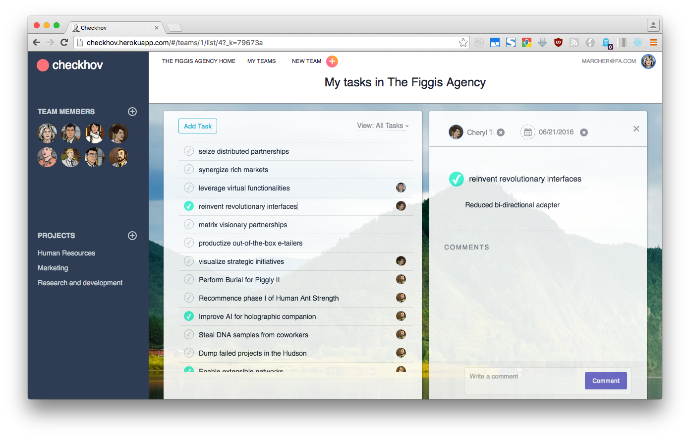

# Checkhov


[Checkhov live][heroku]

[heroku]: http://checkhov.herokuapp.com

Checkhov is a full-stack team and project management application inspired by Asana. Chechov is built on PostgreSQL, Rails and React.

## Features & Implementation

### Single-Page App

Checkhov is a true single-page app; all content is delivered on one static page. All sensitive parts of the app are protected; on entry users are redirected to a splash component that gets the user's authentication status from the API and redirects them to the appropriate page. For users with a valid session token, the splash components loads their teams into a store before redirecting them to the app. Unauthenticated users are referred to a login page.

### Users and Auth

Checkhov supports two forms of authentication: in-site registration and authentication through Google. Users are stored in one table with an email address, optional name and avatar and either a password hash or a Google Oauth UID. Passwords are hashed, salted and securely stored with BCrypt.

### Teams

Teams are where everything starts in Checkhov. All tasks and projects belong to teams, and so no real work can be done in Checkhov without them. After registration, users are led through the process of setting up a new team. Users without any teams get automatically redirected to a team creation page.

The implementation for teams is straightforward. Teams are stored in a single table with a primary key and a string name. All tasks and projects must contain a reference to the team they belong to.

### Team Members

Now that you have a team, you can add new members and begin collaborating. Team memberships are implemented as a join table with a foreign key referencing Users, a foreign key referencing Teams and an integer permissions column. Each bit in the permissions integer corresponds to a specific action that a user is or is not authorized to take depending on the state of that bit. Following is a sample of the code that defines the relation ship between bits and actions:


```ruby
PERMISSIONS = {
  create_task: 1 << 0,
  create_project: 1 << 1,
  create_comment: 1 << 2,
  ...
  add_member: 1 << 8,
  delete_task: 1 << 16,
  delete_project: 1 << 17
}
```

Permissions for specific actions are grouped into roles such as 'ADMIN' and 'GUEST.' When a user creates a team, he or she is automatically set as an admin of that team. Users that are invited to join a team are initialized as guests. Guests are allowed to create and edit tasks for their teams. Only admins may delete resources belonging to a team. Currently there is no way to customize or change a user's permissions, but there are plans to make this permission system more powerful and flexible. See below under "Future Directions for the Project."

### Tasks

Tasks are the meat and bones of Checkhov. This is where most of the functionality of the app lives. Tasks are stored in a single table in the database. Every task must belong to a team and have a name and by default have a boolean 'completed' attribute set to false. Additionally, tasks can have text descriptions, due dates, may be assigned to members of a team, may be commented on (comments live in a separate database table) and may have their completion status changed. Tasks can also belong to a project.

### Projects

Projects belong to teams and are essentially just ways of organizing tasks into separate lists within a team. Any team member can create a new project or add tasks to an existing project within one of their teams.

## Future Directions for Checkhov

I have many plans to continue improving Checkhov. Here are some of the features that could be available in the app soon:

### Improved User Permissions

Currently, team members are categorized as either 'admin' or 'guest', with guests having full read, write and update access in any of their teams while delete operations are restricted solely to admins. In future versions of Checkhov, admins will be able to atomically set individual user permissions for any user and type of action.

### Search

Future versions of Checkhov will offer improved search functionality for users to look for tasks, projects and co-members across all of their teams.

### Notifications and Messaging

Also available in future versions, users will be able to send and receive direct messages and automatically generated notifications of important events (task completions, due dates past) pertaining to their projects and teams.
